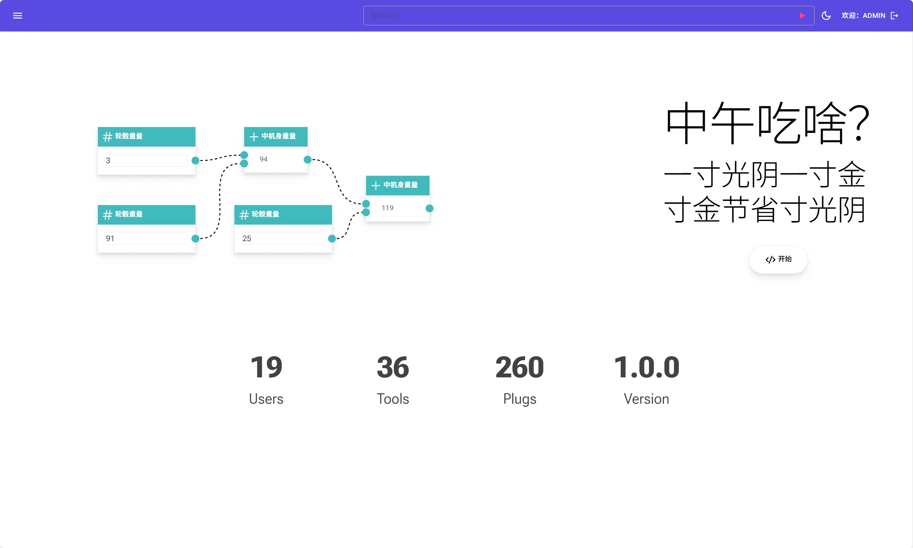
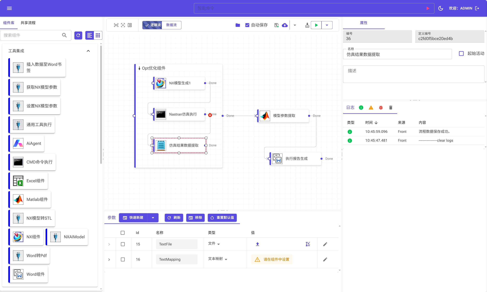
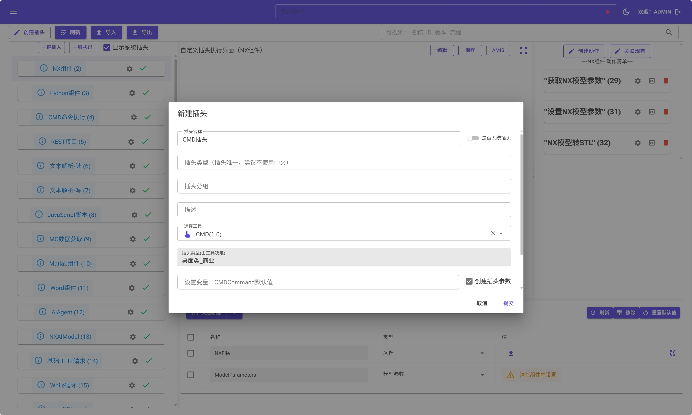
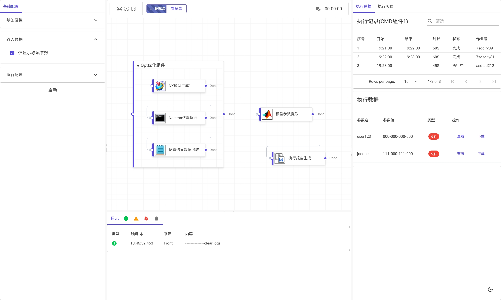

# 寸金插座平台（CJPlug）



## 介绍
寸金插座平台可以将任意软件工具以“插头”的方式插入平台，并提供可视化拖拽设计器，设计和执行复杂的工具链调用流程。并支持一键发布为MCP Tool。应用范围包括多学科设计仿真、自动化工具链调用等。平台完全基于.net core。相关核心依赖项目:

- [Elsa](https://github.com/elsa-workflows/elsa-core)：一款基于.NET的强大工作流引擎。
- [Blazor.Diagrams](https://github.com/Blazor-Diagrams/Blazor.Diagrams)：一款基于Blazor实现的工作流编辑器。
- [MudBlazor](https://github.com/MudBlazor/MudBlazor)：一款个人最喜欢的Blazor前端组件库。
- [Radzen Blazor](https://github.com/radzenhq/radzen-blazor)：另一款优秀的Blazor前端组件库。



## 目录

- [操作文档](#操作文档)
- [进展说明](#进展说明)
- [主要功能](#主要共呢个)
- [路线图](#路线图)
- [应用场景](#应用场景)
- [新增插头](#新增插头)
- [作业监控](#作业监控)
- [Contributing](#contributing)
- [合作支持](#合作支持)
  - [社区支持](#社区支持)
  - [企业支持](#企业支持)

## 操作文档

[文档完善中]().

基本使用：
- 下载后打开02.Publish文件夹
- 双击启动CJ.Plug-Aspire.AppHost/Debug/net9.0/CJ.Plug-Aspire.AppHost.exe
- 如果是linux环境，使用dotnet运行CJ.Plug-Aspire.AppHost.dll
- 启动后，访问http://localhost:5066/ 即可访问CJPlug平台。
- 访问http://localhost:15288/ 即可访问CJPlug平台的服务管理中心（登录密码在启动的控制台中）。

## 进展说明

寸金插座平台任在不断完善中，以下是一些正在完善中的能力和目前的状态：

- 操作文档还在完善中.
- 自定义插头界面设计还未完成.
- 可视化数据流还未完成.
- 第三方流程执行相关接口还在完善中.

## 主要功能

寸金插座平台提供了一系列支撑工具链执行和管理的功能，包括:

- 可视化集成和管理任意工具，并提供工具的个性化配置，如针对不同图站配置不同安装路径.
- 支持图站的任意接入和工具的分布式执行.
- 持久化保存流程执行数据，随时可以进行结果查看、文件下载等.
- 提供可视化拖拽方式设计工具链调用流程，实现逻辑执行和数据传递.
- 支持流程的嵌套调用、流程的发布共享.
- 支持单个组件执行.
- 内置多个插头组件，包括CMD插头、REST插头、文本解析插头、循环插头等.
- 工具链流程支持以Json方式进行导入导出.
- 支持第三方通过API接口进行流程执行及获取流程执行结果数据.
- 支持二次开发插头的热插拔.

## 路线图

工具链调用->多学科仿真优化->大模型集成->基于AI的多学科设计仿真优化。

## 应用场景

寸金插座平台可以应用在多种场景下，包括:

- 多学科设计仿真及优化应用.
- 第三方系统进行工具集成，如PLM系统通过执行流程获取和更新指定模型的参数值.
- 任意自动化工具链执行.
- 以MCP Server的方式将流程提供给LLM调用.

## 新增插头

寸金插座平台支持二次开发方式新增插头，通过依赖注入自动注入平台。同时也支持用户在界面上手动创建插头。通过代码创建插头的方法如下:

```csharp
public class WordPlugCommonSettingContent : IPlugCommonSettingContent
    {
        public Task<RenderFragment?> GetPlugCommonSettingContent(Plug Plug)
        {

            // 根据不同的插件类型返回不同的渲染片段
            if (Plug.PlugTypeKey == PlugKeySetting.CommonSettingPageKey)
            {
                var sequence = 0;
                return Task.FromResult<RenderFragment?>(builder =>
                {
                    builder.OpenComponent<WordPlugCommonSettingPage>(sequence++);
                    builder.SetKey(Plug.PlugTypeKey);
                    builder.AddAttribute(sequence++, nameof(WordPlugCommonSettingPage.Plug), Plug);
                    builder.CloseComponent();

                });
            }

            // 如果没有匹配的插件类型，则返回null或默认的RenderFragment
            return Task.FromResult<RenderFragment?>(null);
        }

        public Task<PlugSettings?> GetPlugBaseSetting()
        {
            var settings = new PlugSettings(null);
            settings.PlugDisplayName = "Word组件";
            settings.PlugType = PlugKeySetting.CommonSettingPageKey;
            settings.PlugTypeKey = PlugKeySetting.CommonSettingPageKey;

            settings.SetSetting(PlugSettingKey.Group.ToString(), PlugGroupEnum.工具集成.ToString());

            var InitVariables = new List<BaseVariable>();
            InitVariables.Add(new BaseVariable()
            {
                Name = InitVariableNames.WordFile.ToString(),
                Type = VariableTypeEnum.File.ToString(),
                IsBrowsable = true
            });
            InitVariables.Add(new BaseVariable()
            {
                Name = InitVariableNames.WordTextMapping.ToString(),
                Type = VariableTypeEnum.WordTextMapping.ToString(),
                IsBrowsable = true,
                IsArray = true
            });

            settings.SetSetting(PlugSettingKey.InitVariables.ToString(),
                JsonSerializer.Serialize(InitVariables));

            return Task.FromResult<PlugSettings?>(settings);
        }
    }
```
或者通过界面手动将工具包装为插头：


## 作业执行监控

寸金插头平台支持持久化保存和管理流程的执行数据，提供作业监控界面进行作业状态监控和结果数据查看下载:



## Contributing

We welcome contributions from the community and are pleased that you are interested in helping to improve the CJPlug project! Here are the steps to contribute to our project:

### 1. Fork and Clone the Repo
To get started, you'll need to fork the repository to your own GitHub account. You can do this by navigating to the [CJPlug GitHub repository](https://github.com/liuszhang/CJPlug) and clicking the "Fork" button in the top-right corner of the page. Once you have forked the repo, you can clone it to your local machine using the following command:

```bash
git clone https://github.com/YOUR_USERNAME/CJPlug.git
```
Replace `YOUR_USERNAME` with your GitHub username. For more information on forking a repo, check out the GitHub documentation [here](https://docs.github.com/en/github/getting-started-with-github/fork-a-repo).

Incorporating the details about the "apps" folder and its projects into the second point about opening the `CJ.Plug-Aspire.sln` using your favorite IDE, we can expand the instructions to guide developers on where to start and what projects they might want to explore first. Here's an updated version of that section with the additional information:

### 2. Open `CJ.Plug-Aspire.sln` Using Your Favorite IDE
After cloning the repository, navigate to the cloned directory and open the `CJ.Plug-Aspire.sln` solution file with your preferred IDE that supports .NET development, such as Visual Studio, JetBrains Rider, or Visual Studio Code with the appropriate extensions.

Within the solution, you will find a "CJ.Plug-Aspire.AppHost" Project designed to help you get started and explore the capabilities of CJPlug:

- **CJ.Plug.ApiServer**: This project is a reference ASP.NET Core application that acts as a api server. 

- **CJ.Plug.HostWebServer**: This project serves a web page server.

- **CJ.Plug.ElsaApiServer**: This project serves an elsa workflow engine server to run workflow.

### 3. Submit a PR with Your Changes
Once you have made your changes, commit them and push them back to your fork. Then, navigate to the original Elsa Workflow repository and create a new Pull Request. Ensure your PR description clearly describes the changes and any relevant information that will help the reviewers understand your contributions. For a detailed guide on creating a pull request, visit [Creating a pull request from a fork](https://docs.github.com/en/github/collaborating-with-issues-and-pull-requests/creating-a-pull-request-from-a-fork).

### 4. Open an Issue First
Before you start working on your changes or submit a pull request, please open an issue to discuss what you would like to do. This step is crucial as it ensures you don't spend time working on something that might not align with the project's goals or might already be under development by someone else. You can open an issue [here](https://github.com/liuszhang/CJPlug/issues).

This approach helps us streamline contributions and ensures that your efforts are aligned with the project's needs and priorities. We look forward to your contributions and are here to support you throughout the process. Thank you for contributing to the CJPlug project!

## 合作支持

我们提供多种方式来支持和合作，帮助您更好地使用和扩展CJPlug平台。

### 社区支持

您可以通过以下任意方式和我们联系:
- [GitHub Issues](https://github.com/liuszhang/CJPlug/issues) for bug reports and feature requests.
- [GitHub Discussions](https://github.com/liuszhang/CJPlug/discussions) for open-ended conversations, questions, and community-driven support.
- 或者加入我们的QQ交流群:  -。

### 企业支持
针对企业用户的特殊需求，请联系[liusz@liusz.com](mailto:liusz@liusz.com).
