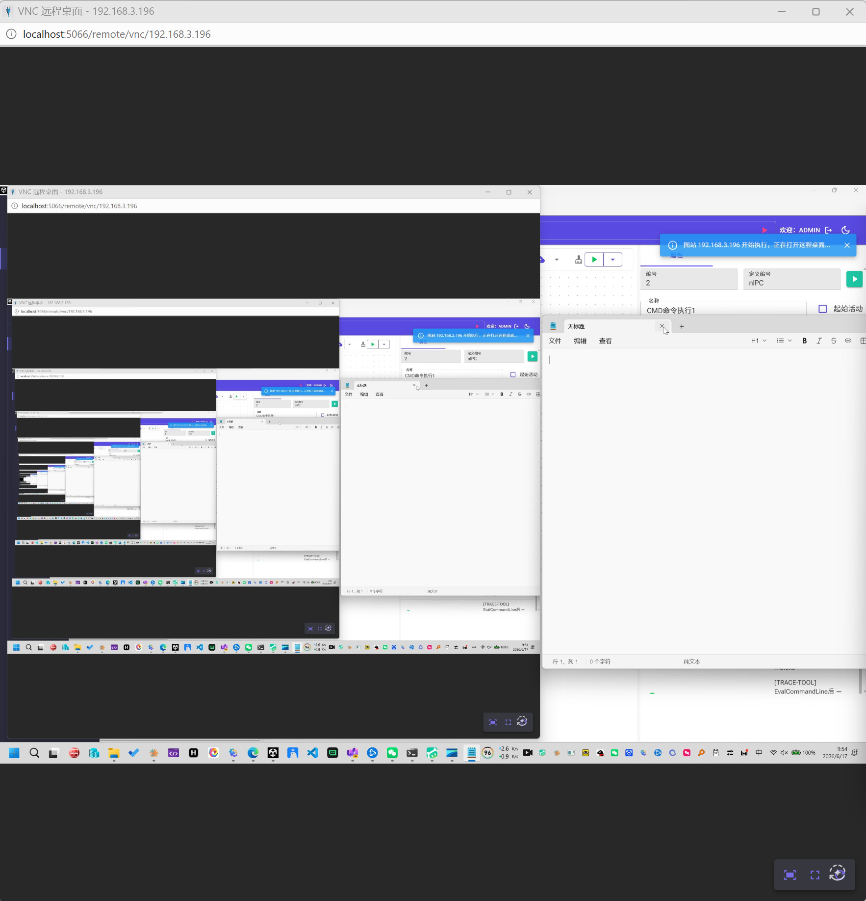
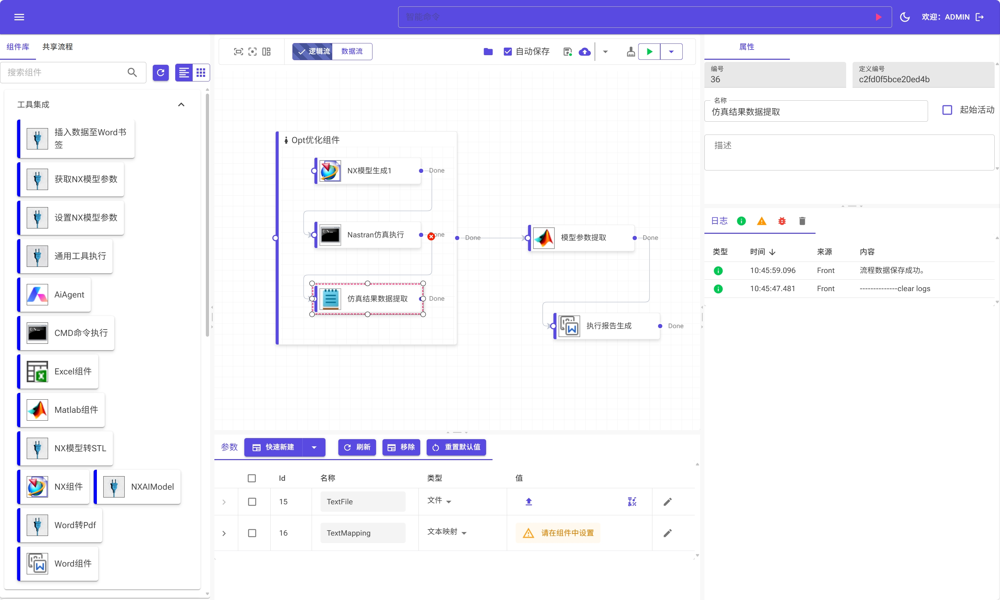
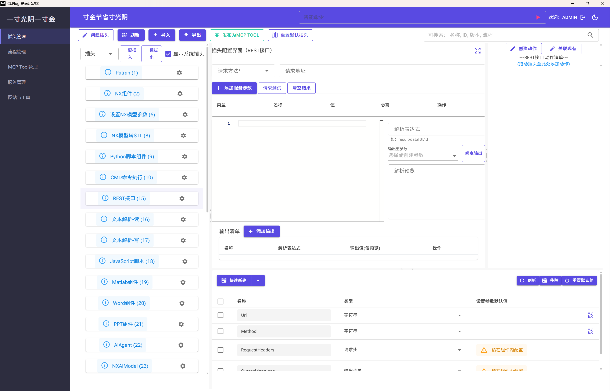
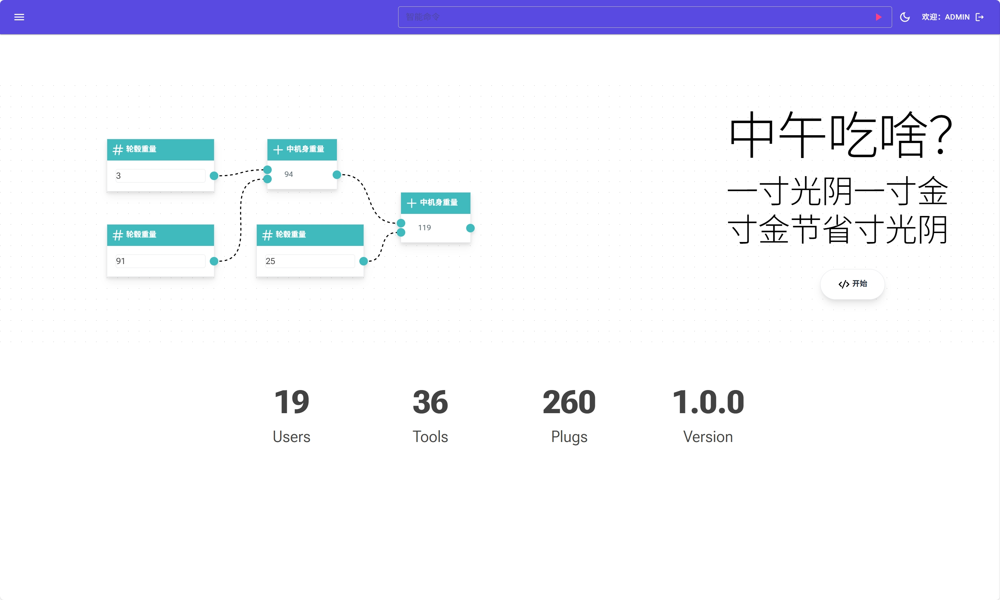
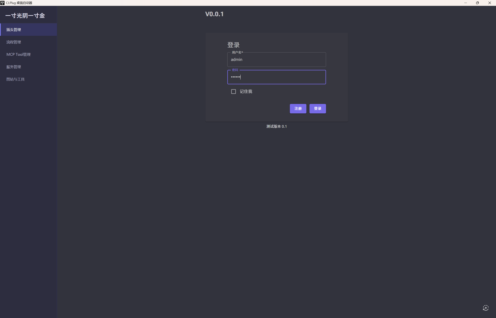
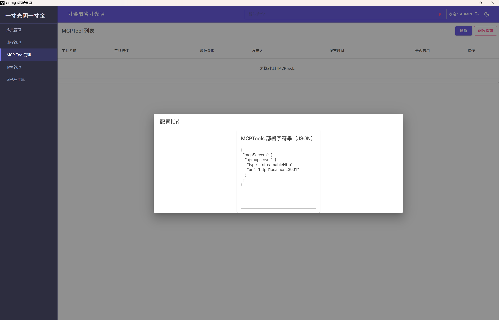
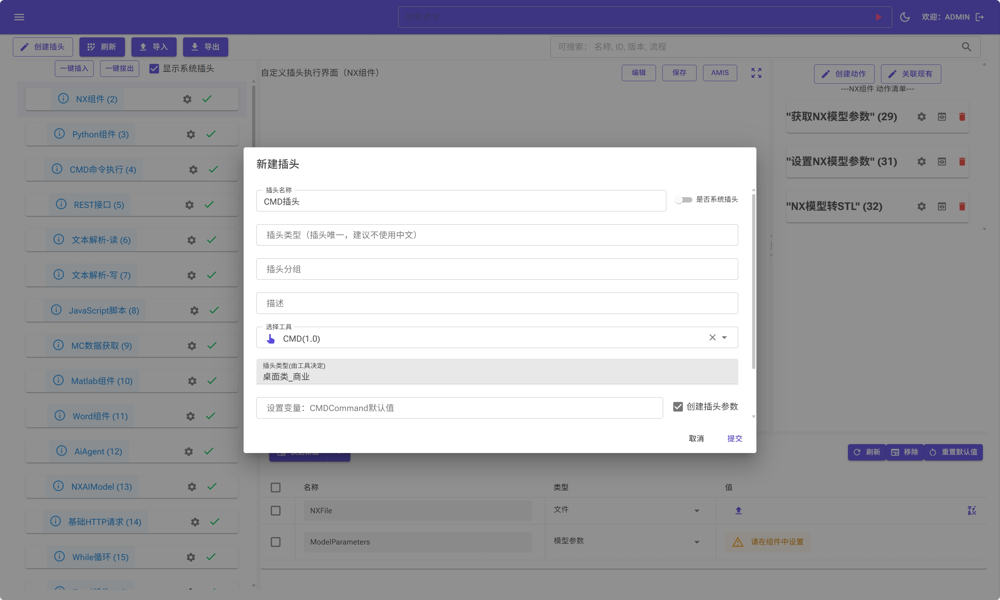
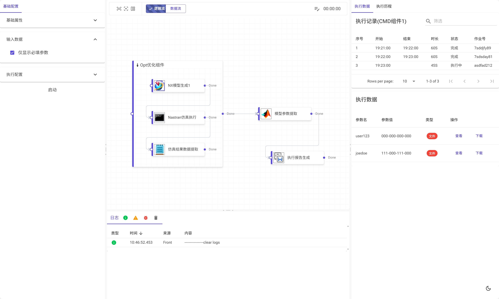

# 寸金插座平台（CJPlug）

[](LICENSE)
[](https://dotnet.microsoft.com/)
[](#将工具或流程发布为MCP-Tool)


---

<!--  ╔═══════════════════ 三大核心能力 ═══════════════════╗  -->

<table width="100%">
<tr>
<td width="33%" align="center" valign="top">

### 🖥️ 纯浏览器远程执行

**多图站分布式可视化调用**


无需安装客户端，打开浏览器即可跨图站（工作站）远程触发任意工具执行，实时回传日志与结果文件。支持多图站并行调度，工具运行在哪台机器上对用户完全透明。

</td>

<td width="33%" align="center" valign="top">

### 🔗 逻辑流 + 数据流串接

**可视化工具流程编排**



拖拽即可将任意插头连成复杂工具链——逻辑分支、循环控制、子流程嵌套，变量在节点间自动传递。支持 AI 自然语言生成流程，也支持 JSON 导入导出复用。

</td>

<td width="33%" align="center" valign="top">

### 🤖 一键发布 MCP Tool

**工具 / 流程 → AI 可调用**



任意插头或完整工具流程，点一个按钮即发布为标准 MCP Tool。Claude、Cursor、Trae 等 AI 客户端立即可发现并调用，零代码接入，Schema 自动生成。

</td>
</tr>
</table>

---



<video width="100%" controls>
    <source src="./03.Website/Video/CJPlug录屏演示-260617.mp4" type="video/mp4">
</video>

---

## 介绍

寸金插座平台（CJPlug）可以将**任意软件工具**（exe、Python 脚本、NX CAD、REST API、Word/Excel 等）以"插头"的方式插入平台，通过**可视化拖拽设计器**编排复杂的自动化工具链流程，并**一键发布为 MCP Tool** 供 AI 客户端（Claude、Cursor、Trae 等）直接调用。

平台完全基于 .NET，核心依赖：

- [Elsa](https://github.com/elsa-workflows/elsa-core)：.NET 工作流引擎，驱动流程执行
- [Blazor.Diagrams](https://github.com/Blazor-Diagrams/Blazor.Diagrams)：Blazor 可视化流程编辑器
- [MudBlazor](https://github.com/MudBlazor/MudBlazor)：Blazor 前端组件库
- [ModelContextProtocol](https://www.nuget.org/packages/ModelContextProtocol.AspNetCore)：MCP 协议实现，将工具流暴露为 AI Tool


## 目录

- [快速启动](#快速启动)
- [架构概览](#架构概览)
- [将工具或流程发布为 MCP Tool](#将工具或流程发布为MCP-Tool)
- [AI 能力](#AI-能力)
- [主要功能](#主要功能)
- [应用场景](#应用场景)
- [新增插头](#新增插头)
- [进展说明](#进展说明)
- [Contributing](#contributing)
- [合作支持](#合作支持)

## 快速启动

### 方式一：桌面启动器（推荐）

下载 `02.Publish` 文件夹后，直接运行桌面启动器：

- **Windows**: 双击 `CJ.Plug.Desktop/Debug/net10.0-windows/CJ.Plug.Desktop.exe`
- **Linux**: 命令行运行 `dotnet CJ.Plug.Desktop.dll`
- 默认账号密码：`admin` / `123456`

桌面启动器内置 WebView2 浏览器，开箱即用，无需额外配置。

### 方式二：Aspire 一键启动全部服务

在开发环境中，通过 .NET Aspire AppHost 一键启动所有 8 个服务：

```bash
cd src/Framework/CJ.Plug.AspireHost.AppHost
dotnet run
```

这会启动完整的服务体系（详见[架构概览](#架构概览)），并自动打开 Aspire Dashboard。

### 方式三：分布式部署

将 `02.Publish` 中各服务目录分别部署到不同机器，修改对应的 `appsettings.json` 配置即可。




## 架构概览

CJPlug 由 **8 个微服务** 组成，通过 **SignalR Hub** 实时通信：

```
                    ┌─────────────────────┐
                    │  Aspire AppHost      │
                    │  (一键编排)           │
                    └────────┬────────────┘
                             │
         ┌───────────────────┼───────────────────┐
         │                   │                   │
         ▼                   ▼                   ▼
   ┌──────────┐       ┌──────────┐       ┌──────────────┐
   │ApiServer │◄─────►│Dispatch  │◄─────►│McpServer     │
   │ :8687    │       │Server    │       │:3001 (MCP)   │
   │主业务API │       │:8686 Hub │       │AI可发现/调用  │
   └────┬─────┘       └────┬─────┘       └──────────────┘
        │                  │
        ▼                  │ (SignalR 广播)
   ┌──────────┐            │                   ┌──────────────┐
   │ElsaEngn  │            │                   │HostWebServer │
   │:5001     │            │                   │:5066 (前端)  │
   │工作流引擎│            │                   │Blazor UI     │
   └──────────┘            │                   └──────────────┘
                           │
   ┌──────────┐            │                   ┌──────────────┐
   │Station   │◄───────────┘                   │ElsaStudio    │
   │ApiServer │  SignalR 心跳                   │:5010 设计器  │
   │:7660     │  + 执行指令 + 日志回报           └──────────────┘
   └────┬─────┘
        │
        ▼
   ┌──────────┐
   │Station   │  cmd.exe 启动工具进程
   │Agent     │  捕获 stdout → 上报结果
   └──────────┘
```

**核心数据流**: 用户编排流程 → Elsa 引擎驱动 → 调度服务选择图站 → StationAgent 执行工具 → 结果回报 → 触发下游节点

## 将工具或流程发布为 MCP Tool

> 这是 CJPlug 最核心的能力：**把任意工具或工具流程一键变为 AI 可调用的 MCP Tool**。

### 三条路径，由快到深

| 路径 | 适用场景 | 改动量 |
|------|---------|--------|
| **A. 一键发布** | 已有工作流或插头，立即暴露给 AI | 零代码 |
| **B. 注册插件能力** | 新开发插件，希望 AI 理解参数语义 | ~40行 C# |
| **C. 静态 Tool** | 纯代码系统操作（列表/状态查询等） | 1 个方法 |

### 路径 A：一键发布（零代码）

1. 创建插头，或设计一个工作流
2. 点击 **”发布为 MCP TOOL”** 按钮
3. 平台自动生成 JSON Schema，McpServer 实时刷新
4. AI 客户端立即可见该 Tool

<video width="100%" controls>
    <source src="./03.Website/Video/CJPlug-增加自定义桌面工具为插头.mp4" type="video/mp4">
</video>

### 路径 B：注册插件能力（`IPluginCapability`）

新增一行代码，让 AI Workflow Builder 理解你的工具并能自动编排：

```csharp
// 1. 声明工具能力
public class MyPluginCapability : IPluginCapability
{
    public string PluginTypeKey => “MyPlug”;
    public string Name => “我的工具”;
    public string Description => “此工具将输入文件转换为指定格式，支持设置质量等级”;
    public string[] Tags => new[] { “文件”, “转换” };

    public List<CapabilityParameter> Inputs => new()
    {
        new() { Name = “inputFile”, Type = “File”, Description = “输入文件路径”, IsRequired = true },
        new() { Name = “quality”, Type = “Int”, Description = “质量等级(1-100)”, IsRequired = false, Value = “80” },
    };
    public List<CapabilityParameter> Outputs => new()
    {
        new() { Name = “outputFile”, Type = “File”, Description = “输出文件路径” },
    };
}

// 2. 在 Program.cs 中注册
capRegistry.Register(new MyPluginCapability());
```

注册后，用户在 AI 对话框中输入”把所有文件转换为高质量输出”，AI 会自动编排包含你工具的完整流程。

### 路径 C：静态 MCP Tool

```csharp
[McpServerToolType]
public static class MySystemTools
{
    [McpServerTool]
    public static string QueryStatus([Description(“任务ID”)] string taskId)
    {
        return JsonSerializer.Serialize(new { status = “running”, progress = 75 });
    }
}
```

### 接入 AI 客户端

进入 **MCP Tool 管理** → 点击 **配置指南** → 复制配置，粘贴到 AI 客户端：

```json
{
  “mcpServers”: {
    “cj-mcpserver”: {
      “type”: “streamableHttp”,
      “url”: “http://localhost:3001”
    }
  }
}
```


启动 McpServer（端口 3001）后，Claude、Cursor、Trae 等支持 MCP 的 AI 客户端即可发现并调用你的工具。

## AI 能力

CJPlug 内置了从**自然语言到工作流自动生成**的完整 AI 能力：

### AI Workflow Builder（自然语言 → 工作流）

```
用户说: “读取NX模型的壁厚，如果小于2mm就修改为2mm，然后导出STL”
                │
                ▼
    ① CapabilityRegistry 将所有已注册工具的能力注入 LLM System Prompt
    ② DeepSeekService 调用 LLM (本地 Ollama / 云端 OpenRouter)
    ③ LLM 根据工具能力生成工作流 JSON
    ④ WorkflowTranslator 翻译为可执行的 Elsa 流程
    ⑤ 自动保存到流程库，可在设计器中可视化编辑
```

### AI Agent 插件

在工作流中插入 AI 调用节点：
- 支持本地 Ollama 模型（qwen3、deepseek-r1、llama3.2）和云端 OpenRouter API
- 动态输入参数 `[paramName]` 模板语法
- 输出绑定到下游插件变量，形成 AI + 工具的混合流程

### 本地 RAG 知识库

`AIChat` 模块提供基于 SQLite 向量数据库的本地知识库检索增强生成（RAG），支持 PDF、Word 等文档的语义搜索。

## 主要功能

- **可视化工具集成** — 管理和配置任意工具，支持不同图站的不同安装路径
- **分布式执行** — 图站（工作站）任意接入，工具分布式执行
- **一键发布 MCP Tool** — 插头或工具流程一键发布为 MCP Tool，AI 客户端即时可用
- **AI 自动编排** — 自然语言描述需求，AI 自动编排工具链，生成可执行流程
- **可视化流程设计** — 拖拽式流程编辑器，支持逻辑控制和数据传递
- **嵌套流程** — 流程可被其他流程作为子流程调用，支持发布共享
- **持久化执行数据** — 所有执行结果持久保存，作业监控界面查看状态、下载结果文件
- **丰富的内置插头** — CMD、REST、Python、文本解析、循环控制、AI Agent 等 20+ 种
- **JSON 导入导出** — 工具链流程以 JSON 格式导入导出
- **第三方 API 集成** — 通过 REST API 远程执行流程并获取结果
- **热插拔二次开发** — 自定义插头通过 DI 自动注入，或通过 XML 配置动态加载

## 应用场景

- **多学科设计仿真及优化** — 串联 CAD/CAE 工具链，参数自动传递与迭代
- **PLM/PDM 系统集成** — 第三方系统通过 API 执行流程，获取和更新模型参数
- **任意自动化工具链** — 数据分析、文档处理、脚本编排等场景
- **MCP Server 暴露给 LLM** — 工具流程作为 AI Agent 的”工具箱”，LLM 自动选择和执行

## 新增插头

寸金插座平台支持二次开发方式新增插头，通过依赖注入自动注入平台。同时也支持用户在界面上手动创建插头。通过代码创建插头的方法如下:

```csharp
public class WordPlugCommonSettingContent : IPlugCommonSettingContent
{
    public Task<RenderFragment?> GetPlugCommonSettingContent(GetSettingContext context)
    {
        var plug = context.Plug;
        // 根据不同的插件类型返回不同的渲染片段
        if (plug.PlugTypeKey == PlugKeySetting.CommonSettingPageKey)
        {
            var sequence = 0;
            return Task.FromResult<RenderFragment?>(builder =>
            {
                builder.OpenComponent<WordPlugCommonSettingPage>(sequence++);
                builder.SetKey(plug.PlugTypeKey);
                builder.AddAttribute(sequence++, nameof(WordPlugCommonSettingPage.Plug), plug);
                builder.CloseComponent();
            });
        }
        return Task.FromResult<RenderFragment?>(null);
    }

    public Task<PlugSettings?> GetPlugBaseSetting()
    {
        var settings = new PlugSettings();
        settings.PlugDisplayName = “Word组件”;
        settings.PlugTypeKey = PlugKeySetting.CommonSettingPageKey;

        settings.SetSetting(PlugSettingKey.Group.ToString(), PlugGroupEnum.工具集成.ToString());

        var InitVariables = new List<BaseVariable>();
        InitVariables.Add(new BaseVariable()
        {
            Name = InitVariableNames.WordFile.ToString(),
            Type = VariableTypeEnum.File.ToString(),
            IsBrowsable = true
        });
        InitVariables.Add(new BaseVariable()
        {
            Name = InitVariableNames.WordTextMapping.ToString(),
            Type = VariableTypeEnum.WordTextMapping.ToString(),
            IsBrowsable = true,
            IsArray = true
        });

        settings.SetSetting(PlugSettingKey.InitVariables.ToString(),
            JsonSerializer.Serialize(InitVariables));

        return Task.FromResult<PlugSettings?>(settings);
    }
}
```
或者通过界面手动将工具包装为插头：


## 进展说明

以下是一些正在完善中的能力：

- 操作文档持续完善中
- 可视化数据流设计器开发中
- MCP Tool 管理功能持续增强
- 更多插头能力注册到 AI Workflow Builder

## 作业执行监控

寸金插座平台支持持久化保存和管理流程的执行数据，提供作业监控界面进行作业状态监控和结果数据查看下载:



## Contributing

欢迎社区贡献！请按以下步骤参与：

### 1. Fork 并 Clone 仓库

点击 [CJPlug GitHub 仓库](https://github.com/liuszhang/CJPlug) 右上角的 "Fork" 按钮，然后：

```bash
git clone https://github.com/YOUR_USERNAME/CJPlug.git
```

### 2. 打开解决方案

使用 Visual Studio、JetBrains Rider 或 VS Code 打开 `CJ.Plug-Aspire.sln`。

解决方案中的主要入门项目：

- **CJ.Plug.AspireHost.AppHost** — .NET Aspire 编排器，一键启动全部服务（推荐从这里开始探索）
- **CJ.Plug.ApiServer** — 主 API 服务器（:8687）
- **CJ.Plug.HostWebServer** — Blazor 前端入口（:5066）
- **CJ.Plug.ElsaApiServer** — Elsa 工作流引擎（:5001）
- **CJ.Plug.McpServer** — MCP 协议服务器（:3001）
- **CJ.Plug.Desktop** — 桌面端启动器（WPF + WebView2）

### 3. 先开 Issue，再提交 PR

在动手修改之前，请先 [创建一个 Issue](https://github.com/liuszhang/CJPlug/issues) 讨论你的想法，确保与项目方向一致且没有重复工作。

提交 PR 时，请清晰描述改动内容和原因。

我们期待你的贡献！

## 合作支持

### 社区支持

- [GitHub Issues](https://github.com/liuszhang/CJPlug/issues) — Bug 报告和功能请求
- [GitHub Discussions](https://github.com/liuszhang/CJPlug/discussions) — 讨论、问答和社区交流
- QQ 交流群 — 请在 GitHub 主页查看最新群号

### 企业支持

针对企业用户的特殊需求，请联系 [liusz@liusz.com](mailto:liusz@liusz.com)。
